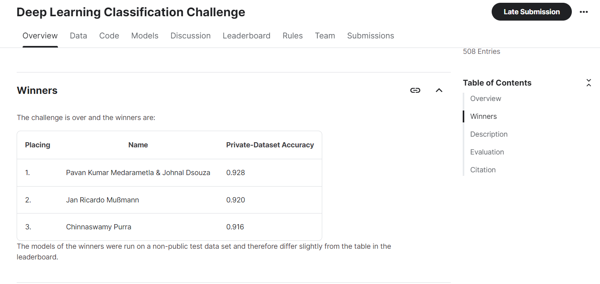

This challenge is part of the Deep Learning course offered by University of Siegen, Germany. Our model scored 98.1% accuracy on public test set.
In the final Secret data set, We got the first place with a Test accuracy of 92.875 % and received Prize money.

The dataset consist of 8 classes consisting of Christmas Objects such as Christmas Cookies, Christmas Presents, Christmas Tree, Fireworks, penguin, reindeer, Santa, Snowman. We fine tuned the  pre-trained Efficientnet_b4.
Used various Augmentation techniques like cutmix, Mixup etc.
Used the concept of SHAP values(concept of Explainable AI) to debug(to understand where our predictions are going wrong)

Link to Challenge: https://www.kaggle.com/competitions/deep-learning-classification-challenge/overview